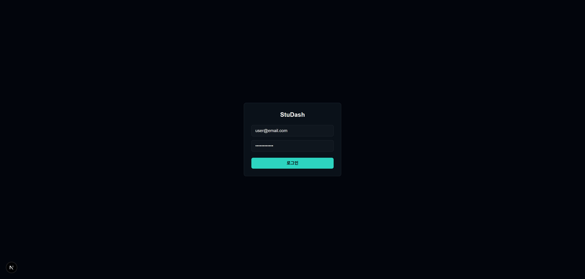
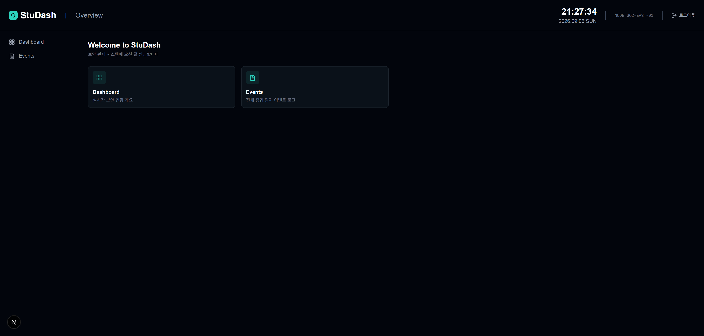
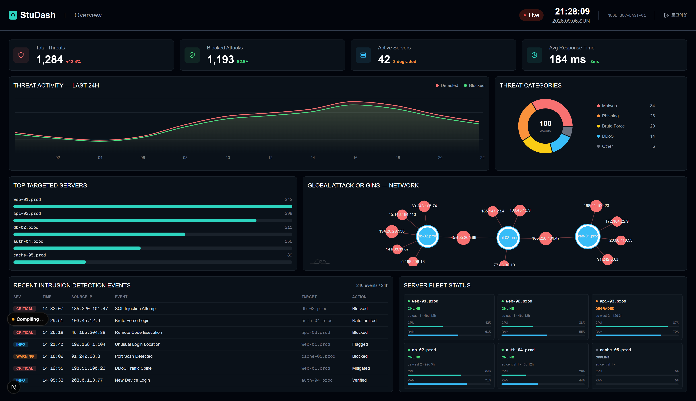
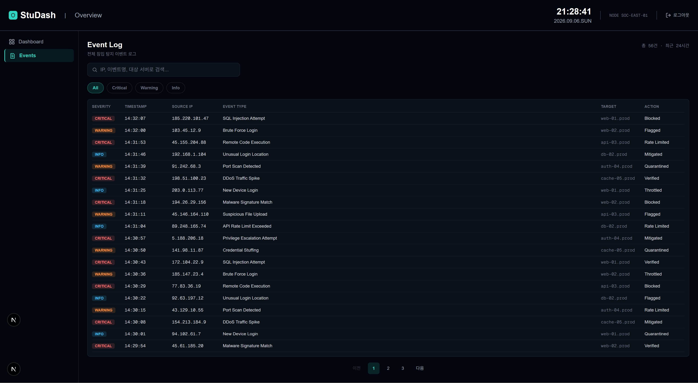

# StuDash

보안 관제(SOC) 컨셉의 실시간 대시보드 토이 프로젝트입니다. 침입 탐지 로그, 서버 상태, 공격 발생 추이/경로 등을 한 화면에서 모니터링하는 형태로 만들었습니다.

🔗 **Live Demo**: [StuDash](https://stu-dash-cyan.vercel.app/)

- **Login**
  
- **Main**
  
- **Dashboard**
  
- **Event Log**
  

## 기술 스택

- **Framework**: Next.js 16 (App Router)
- **Language**: TypeScript
- **Styling**: Tailwind CSS v4 (커스텀 디자인 토큰)
- **Charts**: Recharts (라인/도넛/바 차트), amCharts 4 (네트워크 그래프)

## 페이지 구성

- **`/login`** — 로그인 화면 (백엔드 없이 폼 검증 + 쿠키 기반 로그인 흉내)
- **`/`** — 홈. 환영 메시지 + 각 섹션(Dashboard/Events 등)으로 가는 빠른 이동 카드
- **`/dashboard`** — 메인 대시보드
- **`/events`** — 침입 탐지 이벤트 로그 페이지 (검색, 심각도 필터, 페이지네이션)

## 주요 기능

### Dashboard

- **Threat Activity** — 시간대별 위협 탐지/차단 추이 (Line + Area 차트)
- **Threat Categories** — 위협 유형별 비중 (도넛 차트)
- **Top Targeted Servers** — 공격 최다 대상 서버 순위
- **Global Attack Origins** — 서버 ↔ 공격 IP 간 연관관계 (Force-Directed 네트워크 그래프)
- **Recent Intrusion Detection Events** — 심각도별로 구분된 침입 탐지 로그 테이블
- **Server Fleet Status** — 서버별 상태(온라인/저하/오프라인) 및 리소스 사용량

### Events

- IP·이벤트명·대상 서버 기준 검색
- 심각도(Critical/Warning/Info)별 필터 칩
- 클라이언트 사이드 페이지네이션

### 인증

- 쿠키(`studash_auth`) 유무로 로그인 상태를 판단해 보호된 페이지 접근을 제어
- 로그인하지 않은 상태로 보호된 경로에 접근하면 `/login`으로, 로그인된 상태로 `/login`에 접근하면 `/`로 리다이렉트
- Topbar의 로그아웃 버튼으로 쿠키 삭제 후 재로그인 유도
- 실제 서버 인증은 없는 프론트엔드 전용 목업입니다

## 아키텍처 / 설계 결정

- `Panel` 공통 컴포넌트 + Tailwind `@theme` 색상 토큰(`--color-danger`, `--color-safe` 등)으로 다크 테마 색상을 한 곳에서 관리
- 상태/심각도별 스타일은 `Record<T, string>` 룩업 테이블로 관리해 조건문 없이 매핑
- `GridTable<T>` — 컬럼 정의(`{ key, header, width, render }`)를 데이터로 넘기는 방식의 제네릭 테이블 컴포넌트. 대시보드의 압축된 로그 카드와 Events 페이지의 전체 로그 테이블 양쪽에서 동일한 컴포넌트를 재사용
- `SearchBar`, `FilterChip`, `PageHeader` 등은 "구조(스타일)는 컴포넌트가, 상태/로직은 사용하는 쪽이" 담당하는 controlled 패턴으로 설계 — 검색어·필터 상태는 항상 호출하는 페이지가 소유
- **라우트 그룹으로 레이아웃 분리**: 페이지마다 필요한 chrome(Topbar 유무, Live 배지 유무, Sidebar 유무)이 달라서 `(dashboard)`, `(app)` 두 라우트 그룹으로 나누고 그룹별로 다른 `layout.tsx`를 둠. URL엔 그룹 폴더명이 노출되지 않음
- `Sidebar`는 `usePathname()`으로 현재 경로를 감지해 활성 메뉴를 표시
- 상호작용/브라우저 API가 필요 없는 컴포넌트는 Server Component로 유지하고, 차트나 훅을 쓰는 부분만 `"use client"`로 분리

## 트러블슈팅 / 배운 점

- **Tailwind flex 컨테이너 안에서 `h-full`이 동작하지 않는 문제**: 부모 높이가 확정돼 있지 않으면 퍼센트 높이가 제대로 계산되지 않음 → `flex-1` + `min-h-0` 조합으로 해결
- **Recharts v3의 `Cell` 컴포넌트 deprecation**: 설치된 버전의 타입 정의를 직접 확인해 `shape` prop 기반 커스텀 렌더링으로 마이그레이션
- **amCharts 4(명령형 API)를 React에 통합**: `useRef`로 DOM 컨테이너를 확보하고 `useEffect`에서 차트 인스턴스를 생성/`dispose`하는 패턴으로 연결
- **Next.js 최신 버전의 `allowedDevOrigins`**: 개발 서버가 기본적으로 `localhost` 외 origin(LAN IP 등)의 요청을 차단한다는 걸 알게 되어, 설정 추가로 해결

## 로컬 실행

```bash
git clone https://github.com/JuHyeon-S/StuDash.git
cd StuDash
npm install
npm run dev
```
